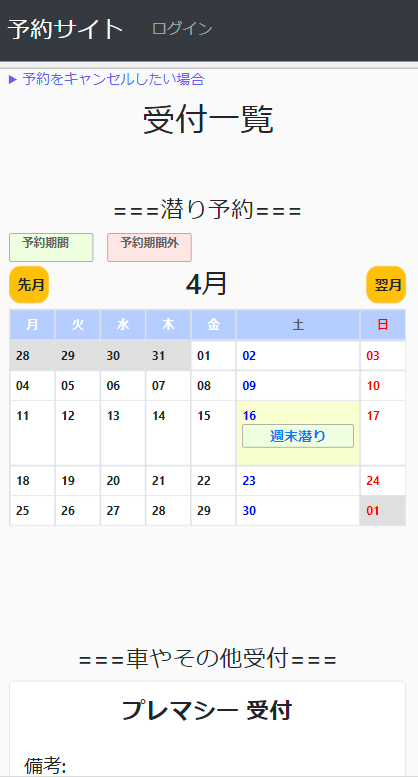
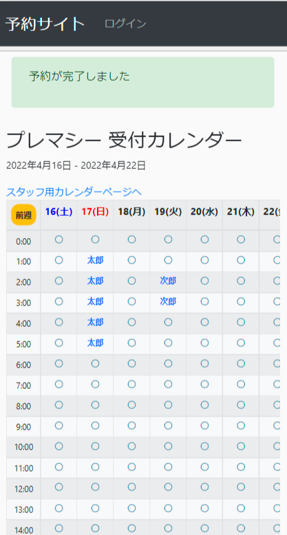

# サークル向けの特化型予約サイト「DivBook」

特定の用途に合わせたweb予約アプリです。友人の所属しているサークルで2022年4月から稼働しています。

こちらからぜひご覧ください。([https://divbook.herokuapp.com/](https://divbook.herokuapp.com/))  
　  

# DivBookの概要

- **1時間単位で物をレンタルするときのレンタル予約**
- **1日単位でのイベントを行うときの参加予約**

の2つを同サイト内で行うことができます。  
　  

主にダイビングサークルにおける「ダイビングの予約」と「サークル所有車の予約」で使用しています。

※参考画像(トップ画面と車のレンタル予約完了画面)

　  
# 使用技術

言語：Python  
フレームワーク：Django  
インフラ、プラットフォーム：Heroku  
データベース：PostgresSQL  

# 開発期間

2022年1月：開発開始  
　  
2022年2月：完成、Herokuへデプロイ  
　  
2022年3月：友人と相談しながら、デザインや欲しい機能、いらない機能を修正  
  <修正記録>  
  ・イベントカレンダーを1週間の表示から1か月の表示に変更(2/20)  
  ・受付不可をまとめて設定できる機能追加(3/2)  
  ・カレンダーにまとめて予約受付を追加する機能追加(3/2)  
  ・簡易的なパスワードで自分の予約を削除できる機能追加(3/4)  
  ・受付のタイトルと備考編集ページの追加(3/15)  
  ・イベント予約の人数制限追加(4/2)  
  　  
2022年4月～：新入生加入のタイミングでサービス運用開始  
　  
　  

# アプリ開発の動機  
友人の既存の予約サイトが使いにくいという悩みを解決させたい思いから、アプリ開発をしました。  
既存の予約サイトでは  
　  
・そもそも1時間単位のレンタル予約と1日単位の参加予約の両立ができるものを探すことが難しい  
・既存サイトでは1, 3, 12時間の選択肢しかないため、細かい時間設定が面倒  
・キャンセルがものすごい大変  
・広告バナーの誤クリックの頻発  
　  
等の不満点があり、欲しい機能はそのままにしつつ、不満点できるだけ解決するという目標で開発を始めました。
